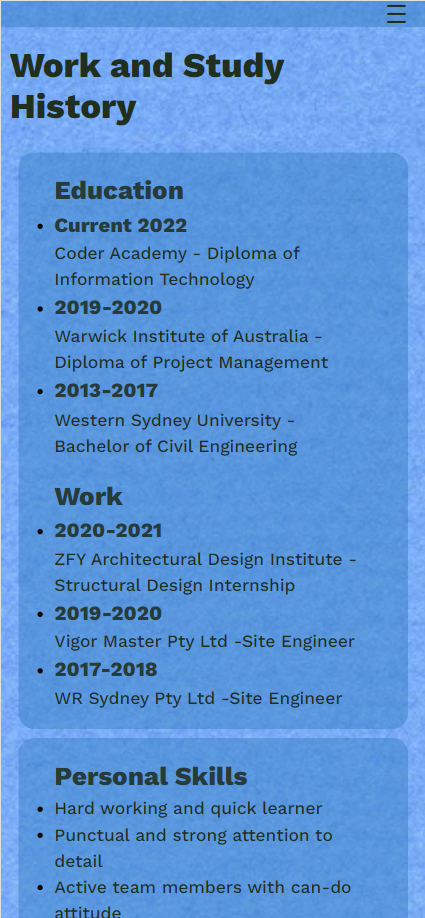
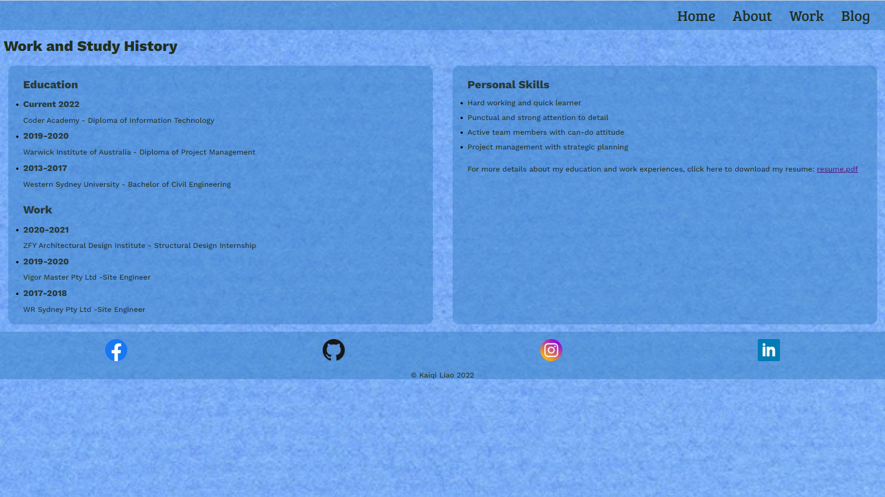

# T1A2 Portfolio Website

Portfolio website url: [Kaiqi Portfolio](https://focused-hopper-e14468.netlify.app)

Github repo: [github repo](https://github.com/Jimmyboei/T1A2-Portfolio)

## Purpose

This portfolio website is a platform to record my web developer journey and present a showcase of my skills. It will be constantly updated with new contents with new skills and ideas gained from my study.

## Features

The site contains 4 pages with responsive and easy to read design. There is a collapsible nav bar for small screens at the top and access to my social media at the bottom. Features of each page are as follows: 

- The Home page follows a simple and clear design. It has my name and simple description in the center and three buttons underneath, which provide navigation to other pages.
  
- The About page has an introduction for myself as well as my personal interests. There are also two pictures about me along with the context. 

- The Work page provides information about my education and work experience. It also includes a list of my personal skills and my resume in pdf version.

- The Blog page contains a list of blog posts. The post is in the blog card style for better layout and easier to organize.

## Site Map

## Screenshots

### Home

### About

### Work

### Blog

## Target Audience

The target audience will be fellow web developers and prospective employers. I believe with perseverant learning and a well-maintained portfolio website, employers can recognize me as a professional developer.

## Tech Stack

The site was first designed in the Balsmiq Wireframes for three responsive views for all pages. After that, it was constructed in the HTML followed by CSS styling. Once the site was completed and tested in responsive view, it was uploaded to Github and deployed on Netlify.